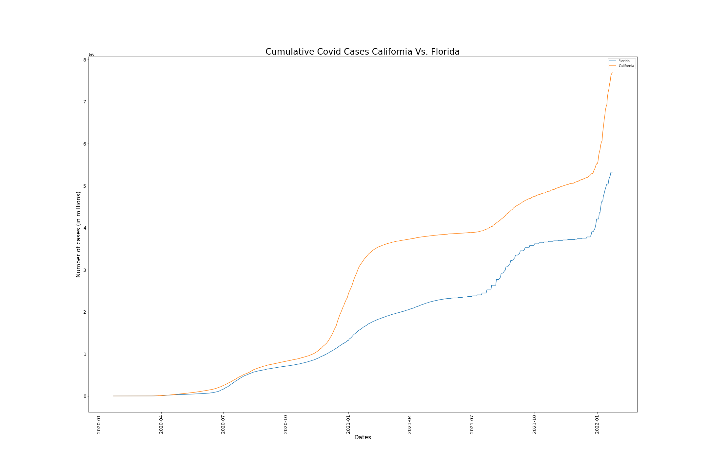
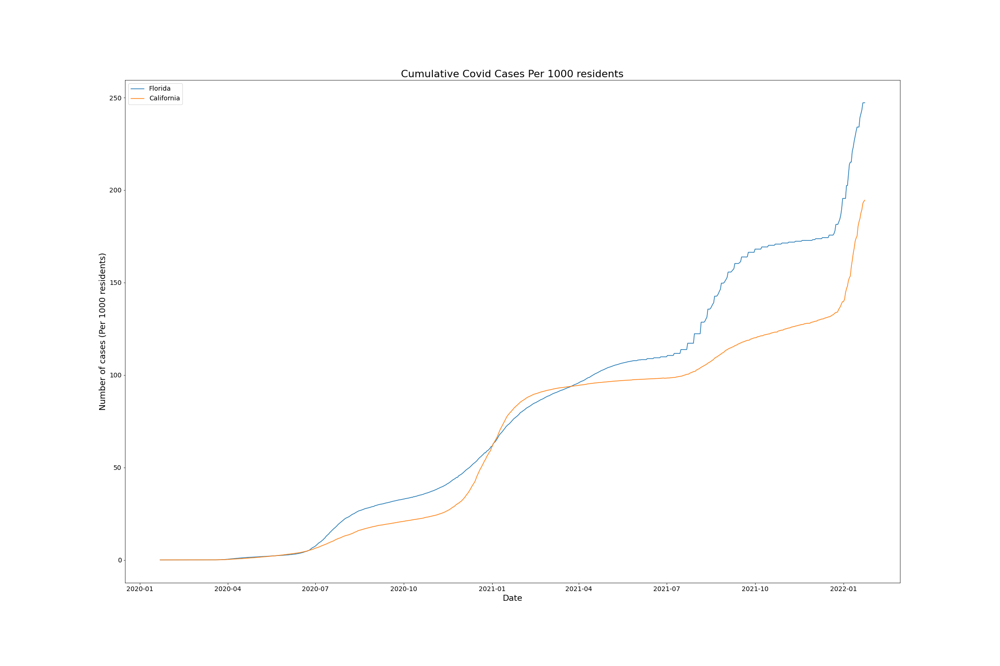
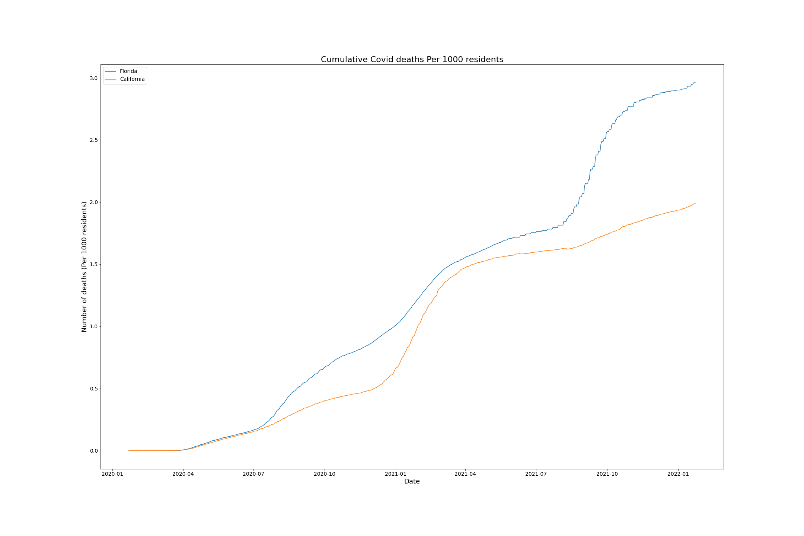

# COVID_Bubble_Estimator
Python project attempting to answer some of my quesitons about the spread and scope of COVID-19 in the United States.

**How Safe are you in your bubble?**

Initialy looking at two of the most criticized states in the USA California appears to be doing less well than Florida

However when we take into account population size differences we see a different story

And Deaths per capita things are not looking good for Florida

## A county by county look at Covid Cases
The size of the dots are relative to the population sizes in the counties, color relates to number of deaths

Interestingly California which has the largest population in the USA at over 39.1 million residents has a moderate mortality rate where Texas, Forida and New York the next three largest population centers are doing much more poorly.  Even more interesting is the fact that some of the smallest counties are struggling the most.  

There does appear to be some question in the data where death rates are 100%.  This can be attributed to inadiquate data collection.  Either only deaths are tested and reported for COVID-19 or counts in either deaths or confirmed cases are under/over reported in some other fashion.  However the data does agree with the general theory that access to medical care in urban areas does reduce mortality.  Also these more urban centers are areas where it is more likely to have a higher vaccinated population.

Coorelation analysis agrees with the reduction in deaths due to vaccination.  Population and number of confirmed cases have a positive coorelation suggesting that the more cases the more likely of contracting this, but is in opposition of the previous figure which showed lower population centers (in some areas of the country) are struggling more than the larger populations.  This suggests that the risk factors for dying to COVID 19 are more than just how many folks have COVID-19 near you and how many neighbors you have.

## KNN Regression prediction accuracy

I was able with the current data construct a KNN Regression algorithm which had ~88% accuracy in predicting the number of deaths given the current factors in my dataset.

This can be further be improved I am sure by updating the dataset with even more factors.  Suggestions I have come up with include population demographics, hospital capacity, average distance to the nearest hospital, and weather.  I'm sure there are many more important factors that should be considered, like other non COVID related deaths in each county/state and other factors common to the region.

## Conclusions

COVID continues to be a difficult virus to predict safety with, however some states and counties appear to be doing the best within the united states.  These states include the northwest and northe east as well as Utah according to this analysis.  It is of course not a complete picture but it is an informative look at how COVID is affecting the United States.